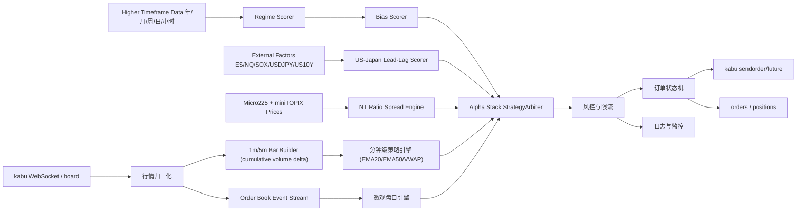

# kabu 日本先物双层自动化交易策略规格书

本文档整理一套面向 kabu ステーション API 的日本先物自动化交易方案。V2 在原有多周期总控和双层执行策略上，升级为 `Alpha Stack` 多引擎系统：

1. `Alpha Stack v2`：统一接收多周期、分钟级、微观盘口、NT 比值、US-Japan lead-lag 和事件风控信号。
2. `Directional Intraday`：以日経225マイクロ先物为主交易品种，ミニTOPIX先物做趋势和市场广度过滤。
3. `Microstructure Scalp`：以日経225マイクロ先物为 1 枚级别实验交易品种，使用盘口不平衡、OFI、microprice 和 spread regime 生成秒级/事件级信号。
4. `NT Ratio Spread`：用 Nikkei/TOPIX 比值 z-score 识别相对价值机会，默认 shadow 记录，不直接重仓自动交易。
5. `US-Japan Lead-Lag / Event Overlay`：用 ES/NQ/SOX、USDJPY、US10Y、银行股代理指标和 BOJ/SQ 事件做过滤、降仓和一票否决。

微观模块在本方案中定义为“个人可运行的盘口超短线”，不是交易所共址级 HFT。所有自动下单前必须能完整记录行情、信号、订单、成交、取消和异常。

多周期共振通常会提高单笔交易的信号质量和胜率，但不保证提高总收益。过滤条件越多，交易次数越少，过拟合风险越高。因此系统优化目标不是单纯提高胜率，而是提高净期望值、回撤稳定性和实盘可重复性。

> 风险提示：本文是自动化交易系统设计文档，不构成投资建议、收益承诺或实盘保证。先物具有杠杆风险，策略必须先经过回测、仿真和最小手数实盘验证。

## 1. 目标与边界

### 1.1 目标

- 形成可直接交给工程实现的策略规格，覆盖信号、下单、风控、日志、测试和验收。
- 使用 kabu ステーション API 能实际支持的接口和限流约束，不依赖网页自动化或第三方模拟点击。
- 先用 Micro225 控制试错成本，再用 miniTOPIX 做过滤和小规模对冲；NT spread 默认先 shadow，不在验证前重仓自动交易。
- 同时保留长期/中期环境判断、分钟级日内逻辑和盘口超短线逻辑，但通过仲裁层避免多个信号互相抢仓位。

### 1.2 非目标

- V1 不做 `日経225マイクロ + TOPIX 大合约` 配对交易，也不把 NT spread 直接作为未验证的大仓位实盘引擎。
- V1 不做共址级 HFT、纳秒级队列预测、做市双边挂单或无限撤改单。
- V1 不使用 `SOR日中/SOR夜間/SOR日通し`，先只使用普通日盘和夜盘市场代码。
- V1 不允许无人监管大仓位运行，微观模块必须先以记录信号模式收集样本。
- V1 不采用“年/月/周/日/小时/分钟/微观全部同向才交易”的硬过滤，因为这会造成信号过少并放大历史拟合风险。

## 2. 标的与基础参数

| 项目 | 日経225マイクロ先物 | ミニTOPIX先物 |
|---|---:|---:|
| 用途 | 主交易品种 | 方向确认、过滤和 NT 对冲 |
| kabu FutureCode | `NK225micro` | `TOPIXmini` |
| 合约乘数 | 日経平均株価 x 10円 | TOPIX x 1,000円 |
| 呼值 | 5円 | 0.25 points |
| tick 价值 | 50円 | 250円 |
| 默认手数 | 1枚起步 | 过滤为主；NT shadow/live 通过仲裁后才允许小规模对冲 |
| 交易节奏 | 1m/5m + 盘口事件 | 1m/5m 过滤 |

交易时间按照 JPX 指数先物常规时段处理：

| Session | 开盘集合 | 连续交易 | 收盘集合 |
|---|---:|---:|---:|
| 日盘 | 08:45 | 08:45-15:40 | 15:45 |
| 夜盘 | 17:00 | 17:00-翌05:55 | 翌06:00 |

禁止交易窗口：

- 日盘 `08:44-08:46`、`15:35-15:45` 不新开仓。
- 夜盘 `16:59-17:01`、`05:50-06:00` 不新开仓。
- 取引最終日前 3 个营业日开始切换到下一限月，不使用即将到期的近月合约开新仓。
- 重要宏观事件、BOJ 相关公告、交易所熔断、行情延迟或 API 异常时进入风控暂停。

## 3. kabu API 接口约束

### 3.1 必用接口

| 功能 | Endpoint | 用途 |
|---|---|---|
| Token | `POST /token` | 获取 `X-API-KEY` |
| 先物代码 | `GET /symbolname/future` | 用 `FutureCode` 和 `DerivMonth` 获取合约代码 |
| 注册行情 | `PUT /register` | 注册 WebSocket PUSH 銘柄 |
| PUSH 行情 | `ws://localhost:18080/kabusapi/websocket` | 获取实时价格、VWAP、成交量、10 档盘口 |
| 板信息 | `GET /board/{symbol}` | 行情补偿、启动快照、异常核对 |
| 先物余力 | `GET /wallet/future` | 风控和下单前检查 |
| 持仓 | `GET /positions` | 查询建玉、HoldID、数量 |
| 订单 | `GET /orders` | 查询订单状态和约定 |
| 下单 | `POST /sendorder/future` | 先物新规/返済下单 |
| 取消 | `PUT /cancelorder` | 取消挂单和 synthetic OCO 对腿 |
| 软限制 | `GET /apisoftlimit` | 启动时读取单笔上限 |

### 3.2 市场代码

| Exchange | 含义 | V1 用法 |
|---:|---|---|
| `23` | 日中 | 日盘下单 |
| `24` | 夜間 | 夜盘下单 |
| `2` | 日通し | V1 不用于下单 |
| `33` | SOR日中 | V1 不使用 |
| `34` | SOR夜間 | V1 不使用 |
| `32` | SOR日通し | V1 不使用 |

### 3.3 下单字段常量

| 字段 | 值 | 含义 |
|---|---:|---|
| `TradeType` | `1` | 新規 |
| `TradeType` | `2` | 返済 |
| `Side` | `"1"` | 売 |
| `Side` | `"2"` | 買 |
| `TimeInForce` | `1` | FAS |
| `TimeInForce` | `2` | FAK |
| `TimeInForce` | `3` | FOK |
| `FrontOrderType` | `20` | 指値 |
| `FrontOrderType` | `30` | 逆指値 |
| `FrontOrderType` | `120` | 成行 |
| `FrontOrderType` | `18` | 引成 |
| `FrontOrderType` | `28` | 引指 |

逆指値规则：

- `ReverseLimitOrder.TriggerPrice`：触发价。
- `ReverseLimitOrder.UnderOver=1`：以下。
- `ReverseLimitOrder.UnderOver=2`：以上。
- `AfterHitOrderType=1`：触发后成行。
- `AfterHitOrderType=2`：触发后指値。
- 止损优先使用逆指値成行，必须配合 `TimeInForce=2`。

### 3.4 限流和安全约束

- 发注系请求约 `5 req/sec`。
- wallet/info 请求约 `10 req/sec`。
- REST/PUSH 注册銘柄上限 `50`。
- 同一銘柄同时订单建议不超过 `5` 件。
- 微观模块必须内置 order throttle，不能每个盘口变动都发单。
- 若收到 `429` 或连续 API 错误，立即暂停新开仓，只保留平仓和取消保护逻辑。

### 3.5 盘口字段归一化

kabu PUSH/board 文档中 `Bid` 和 `Ask` 字段存在历史说明，字段英文名与日文含义可能不符合常见英文交易语义。实现时必须做一次统一映射：

- 对股票、先物、期权，kabu 文档说明 `BidPrice = Sell1.Price`，`AskPrice = Buy1.Price`。
- 因此 raw `BidPrice/BidQty` 必须映射为系统内 `best_ask_price/best_ask_qty`。
- raw `AskPrice/AskQty` 必须映射为系统内 `best_bid_price/best_bid_qty`。
- `Sell1..Sell10` 始终是卖盘深度，`Buy1..Buy10` 始终是买盘深度，不能因为 raw Bid/Ask 字段名反向而交换 10 档。
- `best_ask_price`：市场中可以主动买入成交的最优卖价。
- `best_ask_qty`：最优卖量。
- `best_bid_price`：市场中可以主动卖出成交的最优买价。
- `best_bid_qty`：最优买量。
- `sell_levels[1..10]`：卖方 10 档。
- `buy_levels[1..10]`：买方 10 档。

启动时用 `/board/{symbol}` 和 WebSocket 第一条推送核对：

- `best_ask_price > best_bid_price`。
- `spread = best_ask_price - best_bid_price`。
- 若 spread 小于等于 0 或字段无法归一化，跳过该条行情并记录 `market_data_error`，禁止微观模块基于该条行情下单，但不应断开整个 WebSocket 主循环。
- kabu 先物 PUSH 在极少数时刻会给出 `BidPrice == AskPrice`、`Sell1.Price == Buy1.Price` 的边界快照。这类快照不适合作为微观盘口特征输入，系统应视为不可交易快照并直接跳过，而不是据此重连或放宽盘口校验。

## 4. 系统架构



模块职责：

- `MarketDataAdapter`：连接 WebSocket、补充 board 快照、字段归一化、延迟检测。
- `HigherTimeframeData`：维护连续先物历史数据或外部历史数据，生成年/月/周/日/小时 bar。
- `RegimeScorer`：用年/月/周/日判断大环境、波动状态、一票否决和仓位上限。
- `BiasScorer`：用日线和小时级判断当前更偏 long、short 还是 flat。
- `USJapanLeadLagScorer`：用 ES/NQ/SOX、USDJPY、US10Y、银行股代理指标生成夜盘/美股开盘过滤分。
- `NTRatioSpreadEngine`：计算 `NT = Nikkei225 / TOPIX`、20/60/250 日 z-score、动态 hedge ratio 和 NT shadow/live 信号。
- `BarBuilder`：生成 1m 和 5m OHLCV，计算 VWAP、ATR、EMA、ORB 区间。对 kabu 的 `TradingVolume` 按累计成交量增量转成 bar volume，避免把累计量重复累加到 1m/5m bar。
- `BookFeatureEngine`：计算 spread、weighted imbalance、OFI、microprice、队列变化。
- `MinuteStrategyEngine`：持续更新 Micro225 和 miniTOPIX 的 `trend_bias`，并生成 `ORB breakout`、`trend pullback`、`directional intraday` 三类分钟级方向信号。
- `MicroStrategyEngine`：生成盘口超短信号。
- `StrategyArbiter`：统一处理 Alpha Stack 多引擎冲突、优先级、仓位占用、NT 冲突、外部因子 veto 和组合 beta 上限。
- `RiskManager`：账户级、策略级、订单级风控。
- `OrderManager`：下单、撤单、成交回报、synthetic OCO、孤儿订单恢复。
- `AuditLogger`：写入行情、`signal_eval`、信号、订单、成交、风控事件，并在 heartbeat 中输出 `signal_eval_count`、`signal_allow_count`、`signal_reject_count`。

## 5. 多周期共振总控层

多周期共振总控层的目的，是让大周期负责“能不能做、做哪边、做多大”，分钟级负责“有没有具体 setup”，微观级负责“现在进不进、挂哪里、怎么退”。它不是让所有周期平权投票，也不是要求所有周期必须完全同向。

核心期望值口径：

```text
净期望值 = 胜率 x 平均盈利 - 失败率 x 平均亏损 - 手续费/滑点
```

因此多周期模型上线前必须同时比较胜率、交易次数、平均盈亏、最大回撤和滑点后净收益，不能只看胜率。

### 5.1 五层逻辑

| 层级 | 周期 | 主要作用 | 不建议做什么 |
|---|---|---|---|
| `Regime Layer` | 年/月/周/日 | 判断牛熊、趋势/震荡、高低波动、是否允许交易、仓位上限 | 不直接决定具体买卖点 |
| `Bias Layer` | 日/小时 | 决定当前主方向：`long`、`short`、`flat` | 不和盘口信号同权重 |
| `Setup Layer` | 1-5分钟 | 产生 ORB、VWAP/ATR 趋势回踩、趋势延续等可交易形态 | 不无脑突破就追 |
| `Execution Layer` | 盘口/秒级 | 用 spread、imbalance、OFI、microprice 决定是否立即入场和如何退出 | 不反向推翻大周期 |
| `Risk Layer` | 全周期 | 一票否决、限流、熔断、降仓、强制平仓 | 不为提高胜率而放宽止损 |

### 5.2 评分模型

默认采用评分 + 一票否决模型：

| 分项 | 分值 | 默认计算思路 |
|---|---:|---|
| 长期环境分 `regime_score` | 0-30 | 年/月/周不处于极端反向，日线波动可交易，长期趋势支持或至少不强反向 |
| 日/小时方向分 `bias_score` | 0-30 | 日线结构、小时 EMA/VWAP、关键区间共同给出 long/short/flat 偏置 |
| 分钟 setup 分 `setup_score` | 0-25 | 1m/5m ORB、VWAP/ATR 趋势回踩、趋势延续、miniTOPIX 过滤、session 位置 |
| 微观执行分 `execution_score` | 0-15 | spread=1 tick、imbalance、OFI、microprice、深度、延迟和跳价过滤 |

默认交易门槛：

```text
total_score = regime_score + bias_score + setup_score + execution_score
total_score >= 70 才允许新开仓
execution_score < 10 禁止追单
存在 veto_reason 时禁止新开仓
```

### 5.3 一票否决规则

任一条件成立时，不允许新开仓：

- 年/月/周级别出现极端反向趋势，且当前方向是逆势追单。
- 日线真实波动或跳空超过近期常态，且止损无法覆盖合理滑点。
- 小时级方向与分钟级 setup 强冲突，例如小时级强空但 1m 仅短暂上破。
- 盘口 spread 扩大、WebSocket 延迟超过阈值、深度消失、字段归一化失败。
- 当日已触发账户级、分钟级或微观级熔断。
- 重要事件、交易所异常、合约临近到期但未切换。

### 5.4 仓位与执行规则

| 总分 | 行动 |
|---:|---|
| `< 70` | 不新开仓，只记录信号 |
| `70-79` | 只允许 Micro225 1枚，止盈止损使用保守参数 |
| `80-89` | 允许标准分钟级仓位，但不得超过账户级上限 |
| `>= 90` | 可以放宽止盈目标或允许更长持仓，但不自动加仓 |

微观独立交易仍保持 `Micro225 1枚`，不得因为长期/日线共振而自动扩大微观仓位。大周期只能提高“允许交易”和“目标持仓质量”，不能成为放大超短线风险的理由。

### 5.5 多周期做多示例

```text
Regime Layer:
  年/月/周不处于强空或崩盘状态
  日线波动没有异常放大

Bias Layer:
  日线不弱，小时级在 VWAP/EMA 结构上方
  bias = long

Setup Layer:
  1m/5m 出现 ORB 向上突破、VWAP/ATR 趋势回踩多头 setup，或 directional intraday 趋势延续 setup
  miniTOPIX 不反向

Execution Layer:
  Micro225 spread = 1 tick
  weighted imbalance 偏多
  OFI 偏多
  microprice 在 mid 上方
  最近 3-10 秒无跳价/延迟异常

Result:
  total_score >= 70 且无 veto_reason，允许买入
```

### 5.6 多周期做空示例

```text
Regime Layer:
  年/月/周不处于强多逼空状态
  日线波动可以覆盖止损和滑点

Bias Layer:
  日线偏弱，小时级在 VWAP/EMA 结构下方
  bias = short

Setup Layer:
  1m/5m 出现 ORB 向下突破、VWAP/ATR 趋势回踩空头 setup，或 directional intraday 趋势延续 setup
  miniTOPIX 不反向

Execution Layer:
  Micro225 spread = 1 tick
  weighted imbalance 偏空
  OFI 偏空
  microprice 在 mid 下方
  最近 3-10 秒无跳价/延迟异常

Result:
  total_score >= 70 且无 veto_reason，允许卖出
```

### 5.7 过拟合控制

多周期条件越多，越容易在历史数据里“看起来很完美”。因此：

- 不得为了提高回测胜率无限增加周期和阈值。
- 所有参数必须记录试验次数、样本区间和样本外结果。
- 参数冻结后才允许 shadow live，不允许根据当天亏损临时改规则。
- 回测必须做 walk-forward、样本外、滑点压力测试和 shadow live。
- 参考 Deflated Sharpe Ratio 思路，对多重测试、选择偏差和非正态收益做保守解释。

## 6. Alpha Stack v2 综合多引擎层

Alpha Stack v2 的目标，是把不同时间尺度和不同交易逻辑统一成可仲裁的 `StrategyIntent`，而不是让每个策略直接抢仓位。每个引擎必须输出统一字段：

```text
engine_name
direction
score
signal_horizon
expected_hold_seconds
risk_budget_pct
veto_reason
position_scale
metadata
```

### 6.1 四类 Alpha 引擎

| 引擎 | 主要用途 | 默认实盘权限 |
|---|---|---|
| `Directional Intraday` | Micro225 日内主方向，使用多周期、ORB、VWAP/ATR 趋势回踩、趋势延续和 miniTOPIX 过滤 | 允许最小手数到标准分钟级仓位 |
| `Microstructure Scalp` | 盘口执行和 1 枚级别超短线，使用 spread、OBI、OFI、microprice | 默认 observe_only，验证后最多 1 枚 |
| `NT Ratio Spread` | Nikkei/TOPIX 相对价值，使用 20/60/250 日 z-score 和动态对冲比例 | 默认 shadow，只记录和过滤 |
| `US-Japan Lead-Lag` | 夜盘、美股开盘和日盘交接过滤，使用 ES/NQ/SOX、USDJPY、US10Y、银行股代理指标 | 只做加减分、降仓和 veto |

### 6.2 NT 比值价差引擎

核心公式：

```text
NT = Nikkei225 / TOPIX
hedge_ratio = TOPIXmini_notional / Micro225_notional
Micro225_notional = Nikkei225 x 10円
TOPIXmini_notional = TOPIX x 1,000円
```

默认逻辑：

- 使用 `20/60/250` 日窗口计算 `nt_zscore_20`、`nt_zscore_60`、`nt_zscore_250`。
- `|z| < 2` 只记录，不进入价差交易观察区。
- `z >= 2` 表示 Nikkei 相对 TOPIX 偏贵，方向为 `short Nikkei / long TOPIX`。
- `z <= -2` 表示 Nikkei 相对 TOPIX 偏便宜，方向为 `long Nikkei / short TOPIX`。
- 默认 `mode=shadow`，即使出现 NT 信号也只写入日志，不直接触发真实双腿下单。
- 当 `mode=live` 且通过组合风控后，才允许按动态 hedge ratio 小规模对冲；当前价格下通常接近 `7 枚 Micro225 ≈ 1 枚 miniTOPIX`，但必须实时重算。

### 6.3 US-Japan Lead-Lag 与事件层

外部因子用于提高过滤质量，不是独立追单系统：

- `22:30-24:00` 重点观察 ES/NQ 开盘动量、SOX/半导体方向和 USDJPY。
- `08:45-09:30` 重点观察夜盘到日盘交接，防止追入隔夜过度延伸后的反向波动。
- US10Y 上行默认对成长/科技权重形成压力，银行股偏强可作为 TOPIX 广度确认。
- BOJ、重大 SQ、指数调整、交易所异常、极端跳空时，事件层可以直接给出 `event_risk_flag`。
- 外部数据缺失时系统降级为 kabu 内部数据模式，不报错、不强行禁止交易，但日志必须标记 `external_data_missing`。

### 6.4 仲裁优先级

固定优先级如下：

1. 风险、熔断、事件 veto 永远优先。
2. 已有仓位的保护出场优先于任何新开仓。
3. 活跃 NT spread 仓位会降低同方向日内暴露，反方向强冲突时禁止新开仓。
4. 分钟级 setup 决定主交易方向，微观信号只决定现在是否值得成交。
5. 微观信号不得反向推翻多周期和分钟级方向。
6. 外部因子只做加减分、降仓或 veto，不直接生成裸追单。

### 6.5 组合级风险预算

| 风险项 | 默认值 |
|---|---:|
| Directional Intraday 单笔风险 | `0.25%-0.40%` |
| Microstructure Scalp 单笔风险 | `0.05%-0.10%` |
| NT Ratio Spread 最大风险 | `0.50%` |
| 夜盘仓位系数 | 日盘的 `50%` |
| 组合 Nikkei beta 上限 | `0.30` |
| 事件风险仓位系数 | 默认降到 `50%` 或直接 veto |

日志新增字段：

```text
engine_name
signal_horizon
nt_ratio
nt_zscore_20
nt_zscore_60
nt_zscore_250
hedge_ratio
external_factor_score
event_risk_flag
portfolio_beta
alpha_stack_score
```

## 7. 策略仲裁规则

多个引擎共享同一个 Micro225 账户级净仓位，并可能使用 miniTOPIX 做过滤或小规模对冲，因此必须有统一仲裁层。

### 7.1 仓位命名空间

| 命名空间 | 允许持仓 | 默认手数 | 说明 |
|---|---:|---:|---|
| `minute_core` | Micro225 | 1-3枚 | 分钟级主引擎 |
| `micro_book` | Micro225 | 1枚 | 盘口实验引擎 |
| `nt_ratio_spread` | Micro225 + miniTOPIX | shadow 或最小对冲 | 相对价值引擎 |
| `lead_lag_filter` | 无 | 0 | 外部因子过滤 |
| `topix_filter` | 无 | 0 | miniTOPIX 趋势和广度过滤 |

### 7.2 优先级

1. 已有持仓的保护出场永远优先于新开仓。
2. 多周期总控层和组合风险优先于所有策略信号。
3. NT spread 若已 live 持仓，日内方向仓位必须降级，强反向冲突时禁止新开仓。
4. 分钟级引擎优先于微观引擎。
5. 微观引擎只在多周期 bias 与分钟级方向同向，或分钟级为空仓且总分达标时允许下单。
6. 若分钟级信号为多、微观信号为空，禁止微观开空；反之亦然。
7. 若分钟级信号为空、微观信号有效，可以允许微观 1枚短线交易，但必须满足 `total_score >= 70`。
8. 若任一引擎触发账户级熔断，所有引擎都停止新开仓。
9. 若微观引擎单独触发熔断，只关闭微观引擎，分钟级和 shadow 记录可继续运行。

### 7.3 状态机

```text
BOOT
  -> AUTHENTICATED
  -> SYMBOL_READY
  -> MARKET_DATA_READY
  -> WARMUP
  -> TRADING_ENABLED
  -> RISK_PAUSED
  -> FLATTEN_ONLY
  -> SHUTDOWN
```

状态说明：

- `WARMUP`：至少等待 30 分钟分钟级数据，微观模块至少等待 300 个盘口事件。
- `TRADING_ENABLED`：允许按策略规则新开仓。
- `RISK_PAUSED`：不允许新开仓，允许平仓和取消。
- `FLATTEN_ONLY`：只允许平仓，禁止新开和补挂止盈。
- `SHUTDOWN`：取消所有挂单，核对持仓，生成日报。

## 8. 分钟级主引擎

### 8.1 数据周期

- 主周期：`1m`。
- 过滤周期：`5m`。
- ATR：`ATR(14)`，使用 1m bar。
- VWAP：session 内成交量加权价格，日盘和夜盘分别重置。
- EMA：默认维护 `EMA20` 和 `EMA50`，作为分钟级趋势结构的核心参考。
- ORB：开盘后前 `5m` 或 `15m` 的高低区间，默认 `5m`。
- 成交量：kabu `TradingVolume` 为累计量时，BarBuilder 必须先转成增量成交量后再生成 1m/5m OHLCV；否则 VWAP、量比和突破质量会被重复放大。
- 趋势偏置刷新：每根闭合 1m bar 都刷新 `last_minute_bias` 和 `last_topix_bias`，不能等到真正发出分钟级信号时才更新方向。

### 8.2 miniTOPIX 过滤

多头允许条件：

- miniTOPIX 当前价在 session VWAP 上方。
- miniTOPIX `EMA20 >= EMA50`。
- miniTOPIX 1m EMA20 斜率为正，或至少不为负。
- miniTOPIX 最近 5m 低点不持续下破。

空头允许条件：

- miniTOPIX 当前价在 session VWAP 下方。
- miniTOPIX `EMA20 <= EMA50`。
- miniTOPIX 1m EMA20 斜率为负，或至少不为正。
- miniTOPIX 最近 5m 高点不持续上破。

中性或冲突：

- 若 Micro225 有信号但 miniTOPIX 不确认，放弃该笔交易。
- 若 miniTOPIX 数据延迟超过 3 秒，分钟级策略不新开仓。

### 8.3 ORB 开盘突破

适用时段：

- 日盘：`08:50-10:30`。
- 夜盘：`17:05-20:00`。

多头入场：

1. 形成 opening range：默认 `08:45-08:50` 或 `17:00-17:05`。
2. Micro225 最新 1m 收盘价突破 ORB 高点。
3. 价格在 VWAP 上方。
4. `EMA20 >= EMA50`，且 `trend_bias = long`。
5. 当前 bar `close_location >= 0.65`，即收盘更接近 bar 高点而不是高位回落。
6. `range_ratio >= 1.10`，即当前 1m 波动不弱于最近平均 bar range。
7. `volume_ratio >= 1.00`，即当前 bar 量能不弱于最近平均 bar volume。
8. miniTOPIX 过滤为多头允许。
9. 当前 spread 不超过正常 spread 的 2 倍。

空头入场：

1. Micro225 最新 1m 收盘价跌破 ORB 低点。
2. 价格在 VWAP 下方。
3. `EMA20 <= EMA50`，且 `trend_bias = short`。
4. 当前 bar `close_location <= 0.35`，即收盘更接近 bar 低点而不是低位反抽。
5. `range_ratio >= 1.10`。
6. `volume_ratio >= 1.00`。
7. miniTOPIX 过滤为空头允许。
8. 当前 spread 不超过正常 spread 的 2 倍。

下单：

- 默认 `Qty=1`。
- 使用 aggressive limit FAK：
  - 买入价 = `best_ask_price + 1 tick`。
  - 卖出价 = `best_bid_price - 1 tick`。
- 若未成交，不追第二次；等待下一根 1m bar 重新判断。

### 8.4 VWAP/ATR 趋势回踩

适用时段：

- 日盘：`10:30-14:45`。
- 夜盘：`20:00-01:00`。
- `01:00-05:50` 默认不开新仓，除非回测证明夜间后段有效。

当前实现不再把这一模块定位为“纯震荡回归”，而是定位为“顺大方向的回踩再上/再下”：

- 先由 `trend_bias` 判定当前主方向。
- 只有价格仍站在 VWAP 同侧、并且 `EMA20/EMA50` 结构没有破坏时，才允许把靠近 VWAP 的回踩视为继续上车点。
- ATR 主要用于确定回踩容忍带和风险距离，而不是把价格强行拉回 VWAP。

多头回踩：

1. `trend_bias = long`。
2. 当前收盘价仍在 VWAP 上方，且收盘价不低于 `EMA20`。
3. 上一根或最近一根 1m bar 的低点触及 `VWAP + 0.35 x ATR` 一带，视为对趋势公平价的浅回踩。
4. 当前 1m bar 为阳线，且 `close_location >= 0.60`。
5. `volume_ratio >= 0.90`。
6. miniTOPIX 不处于强空趋势。

空头回踩：

1. `trend_bias = short`。
2. 当前收盘价仍在 VWAP 下方，且收盘价不高于 `EMA20`。
3. 上一根或最近一根 1m bar 的高点触及 `VWAP - 0.35 x ATR` 一带。
4. 当前 1m bar 为阴线，且 `close_location <= 0.40`。
5. `volume_ratio >= 0.90`。
6. miniTOPIX 不处于强多趋势。

下单：

- 默认使用限价挂在靠近当前盘口的回撤价。
- 若 20 秒未成交，取消订单。
- 若成交后 2 根 1m bar 内没有重新顺趋势扩张，提前减仓或平仓。

### 8.5 Directional Intraday 趋势延续

该模块用于捕捉已经建立方向后的二次扩张，不依赖 ORB 时段，也不要求重新触碰 VWAP。

多头延续：

1. `trend_bias = long`。
2. 当前 1m 收盘价高于 VWAP、EMA20、EMA50。
3. 当前 bar 为阳线，`close_location >= 0.65`。
4. `range_ratio >= 1.00`，`volume_ratio >= 0.95`。
5. 当前收盘价至少高于前一根 1m bar 收盘价。
6. miniTOPIX 不处于强空趋势。

空头延续：

1. `trend_bias = short`。
2. 当前 1m 收盘价低于 VWAP、EMA20、EMA50。
3. 当前 bar 为阴线，`close_location <= 0.35`。
4. `range_ratio >= 1.00`，`volume_ratio >= 0.95`。
5. 当前收盘价至少低于前一根 1m bar 收盘价。
6. miniTOPIX 不处于强多趋势。

输出：

- 引擎名记录为 `directional_intraday`。
- setup 原因记录为 `trend_continuation_long` / `trend_continuation_short`。
- 该模块用于补足 ORB 后和午后/夜盘中段的顺势扩张段。

### 8.6 分钟级出场

默认参数：

| 项目 | 默认值 |
|---|---:|
| 初始止损 | `max(6 ticks, ATR(14) x 0.8)` |
| 初始止损上限 | `12 ticks` |
| 初始止盈 | `1.5R` |
| 保本移动 | 浮盈达到 `1R` |
| 最长持仓 | `45分钟` |
| 收盘强平 | 收盘前 `10分钟` |

出场规则：

- 入场成交后立即挂 synthetic OCO：止盈限价 + 止损逆指値成行。
- 任一对腿成交后，立即取消另一对腿。
- 若取消失败，进入 `FLATTEN_ONLY` 并持续查询 `/orders` 和 `/positions`。
- 若 WebSocket 中断超过 3 秒，保留交易所已挂止损，不再新开仓。
- 若持仓无保护止损超过 2 秒，立即用返済成行或 aggressive limit 平仓。

## 9. 微观高频/盘口引擎

### 9.1 定位

微观模块只交易 Micro225，目标是捕捉 `1-3 ticks` 的短期价格偏移。它依赖盘口结构，但必须接受 kabu API 的限流和本地终端延迟限制，因此不是每次盘口变化都下单。

默认运行阶段：

1. `observe_only`：只记录信号，不下单。
2. `paper_trade`：模拟成交和滑点。
3. `live_1lot`：只允许 Micro225 1枚。
4. `live_limited`：需要人工复盘批准，V1 不默认进入。

### 9.2 特征定义

#### Spread

```text
spread = best_ask_price - best_bid_price
spread_ticks = spread / 5
```

微观模块只在 `spread_ticks == 1` 时开仓。若 spread 扩大到 2 ticks 以上，禁止新开仓，并优先退出已有微观持仓。

#### Weighted Book Imbalance

使用前 3-5 档，默认 5 档。

```text
weight_i = 1 / i
buy_depth = sum(weight_i * buy_qty_i)
sell_depth = sum(weight_i * sell_qty_i)
imbalance = (buy_depth - sell_depth) / (buy_depth + sell_depth)
```

解释：

- `imbalance > +0.25`：买方挂单明显更强。
- `imbalance < -0.25`：卖方挂单明显更强。
- `abs(imbalance) < 0.10`：盘口中性，不交易。

默认阈值：

| 参数 | 默认值 |
|---|---:|
| `imbalance_entry` | `0.30` |
| `imbalance_exit` | `0.10` |
| `depth_levels` | `5` |
| `min_total_depth` | 最近 5 分钟中位数的 `40%` |

#### OFI

OFI 使用连续盘口事件计算。对每个事件，比较本次和上次最优价量变化。

简化定义：

```text
bid_contribution =
  +new_bid_qty, if bid_price > prev_bid_price
  new_bid_qty - prev_bid_qty, if bid_price == prev_bid_price
  -prev_bid_qty, if bid_price < prev_bid_price

ask_contribution =
  -new_ask_qty, if ask_price < prev_ask_price
  -(new_ask_qty - prev_ask_qty), if ask_price == prev_ask_price
  +prev_ask_qty, if ask_price > prev_ask_price

ofi = bid_contribution + ask_contribution
ofi_ewma = EWMA(ofi, half_life=2s)
```

多头要求 `ofi_ewma > ofi_entry_threshold`，空头要求 `ofi_ewma < -ofi_entry_threshold`。阈值由最近 30 分钟 OFI 绝对值分位数动态估计，默认使用 70% 分位数。

#### Microprice

```text
microprice = (best_ask_price * best_bid_qty + best_bid_price * best_ask_qty)
             / (best_bid_qty + best_ask_qty)
microprice_edge_ticks = (microprice - mid_price) / tick_size
```

多头要求 `microprice_edge_ticks >= +0.15`。空头要求 `microprice_edge_ticks <= -0.15`。

#### Jump Filter

最近 `3-10秒` 内若出现以下任一情况，禁止新开仓：

- 单次跳价超过 `3 ticks`。
- spread 从 1 tick 突然扩大到 3 ticks 以上。
- WebSocket 事件间隔超过 `500ms` 后突然补发大量更新。
- Micro225 与 miniTOPIX 方向突然背离，且背离超过最近 5 分钟均值的 2 倍标准差。

### 9.3 微观多头入场

允许条件：

1. 当前系统状态为 `TRADING_ENABLED`。
2. 多周期总分 `total_score >= 70`，且没有 `veto_reason`。
3. 微观执行分 `execution_score >= 10`。
4. 没有分钟级空头持仓或空头信号。
5. Micro225 spread 为 1 tick。
6. `imbalance >= +0.30`。
7. `ofi_ewma` 为正且超过动态阈值。
8. `microprice_edge_ticks >= +0.15`。
9. 最近 3-10 秒无 jump filter。
10. miniTOPIX 不为空头强趋势。
11. 距离上一次微观订单至少 3 秒。

下单：

- 首选指値 FAK：`Price = best_ask_price`。
- 若盘口刚刚上移且 microprice 仍偏多，可用 aggressive limit：`Price = best_ask_price + 1 tick`。
- 禁止普通入场使用裸成行。
- 未成交则不追单，等待下一次信号。

### 9.4 微观空头入场

允许条件：

1. 当前系统状态为 `TRADING_ENABLED`。
2. 多周期总分 `total_score >= 70`，且没有 `veto_reason`。
3. 微观执行分 `execution_score >= 10`。
4. 没有分钟级多头持仓或多头信号。
5. Micro225 spread 为 1 tick。
6. `imbalance <= -0.30`。
7. `ofi_ewma` 为负且绝对值超过动态阈值。
8. `microprice_edge_ticks <= -0.15`。
9. 最近 3-10 秒无 jump filter。
10. miniTOPIX 不为多头强趋势。
11. 距离上一次微观订单至少 3 秒。

下单：

- 首选指値 FAK：`Price = best_bid_price`。
- 若盘口刚刚下移且 microprice 仍偏空，可用 aggressive limit：`Price = best_bid_price - 1 tick`。
- 未成交则不追单。

### 9.5 微观出场

默认参数：

| 项目 | 默认值 |
|---|---:|
| 止盈 | `2 ticks` |
| 最小止盈 | `1 tick` |
| 最大止盈 | `3 ticks` |
| 止损 | `3 ticks` |
| 最大止损 | `4 ticks` |
| Time stop | `20秒` |
| 最大持仓 | `30秒` |

立即出场条件：

- 达到止盈或止损。
- `imbalance` 回落到 `abs(imbalance) < 0.10`。
- OFI 翻转并超过反向阈值。
- microprice 回到中性或反向。
- spread 扩大到 2 ticks 以上。
- WebSocket 延迟超过 500ms。
- 分钟级引擎产生反向强信号。
- 多周期 bias 反向且出现 `veto_reason`。
- 持仓超过 time stop 且浮盈未达到 1 tick。

出场下单：

- 正常出场使用 aggressive limit FAK。
- 异常出场和止损可使用成行或逆指値成行。
- 如果 2 秒内未确认成交，重复查询 `/orders` 和 `/positions`，避免重复平仓。

### 9.6 微观限流器

微观模块必须同时满足以下限制：

| 限制 | 默认值 |
|---|---:|
| 最小订单间隔 | `3秒` |
| 每分钟最大新开仓 | `6次` |
| 每分钟最大取消 | `10次` |
| 同时活动订单 | `1个入场 + 1个保护出场` |
| 连续未成交次数 | `5次后暂停5分钟` |
| 连续亏损 | `5笔后暂停当日微观模块` |

## 10. 风控体系

### 10.1 账户级风控

| 风控项 | 默认值 |
|---|---:|
| 单日总亏损上限 | 账户净值 `1.0%` |
| 单日 R 亏损上限 | `3R` |
| 全账户最大 Micro225 净仓位 | `3枚` |
| V1 默认 Micro225 仓位 | `1枚` |
| 保证金缓冲 | 可用余力必须大于需求的 `150%` |
| 交易异常后模式 | `FLATTEN_ONLY` |

账户级熔断触发后：

1. 停止两个策略引擎新开仓。
2. 取消所有非保护订单。
3. 保留或重挂必要止损。
4. 若持仓无保护，优先平仓。
5. 生成风控事件日志。

### 10.2 分钟级风控

| 风控项 | 默认值 |
|---|---:|
| 单笔风险 | `0.25%` |
| 连续亏损 | 3 笔停止分钟级新开仓 |
| 最大持仓时间 | 45 分钟 |
| 最大滑点 | 3 ticks |
| 禁止加仓 | 是 |
| 禁止马丁 | 是 |

### 10.3 微观风控

| 风控项 | 默认值 |
|---|---:|
| 单笔风险 | `0.05%-0.10%` |
| 默认仓位 | 1枚 |
| 连续亏损 | 5 笔停止当日微观模块 |
| 滑点熔断 | 最近 20 笔均值超过 2 ticks |
| 延迟熔断 | WebSocket 延迟超过 500ms |
| 盘口异常 | spread 扩大或深度消失立即退出 |

### 10.4 NT spread 与组合风控

| 风控项 | 默认值 |
|---|---:|
| NT spread 默认模式 | `shadow` |
| NT spread 单笔最大风险 | `0.50%` |
| 入场观察阈值 | `|zscore| >= 2.0` |
| 回归目标 | `|zscore| <= 0.5` |
| 止损逻辑 | z-score 继续扩大 `1σ` 或结构因子失效 |
| 最大持仓时间 | `3-15` 个交易日 |
| 动态对冲 | 按 Micro225 与 miniTOPIX 名义金额重算 |
| 组合 Nikkei beta 上限 | `0.30` |
| 夜盘仓位 | 不超过日盘标准仓位的 `50%` |
| SQ/BOJ/重大事件 | 降仓、只平仓或禁止新开 |

组合风控必须在单策略风控之前执行：如果 `portfolio_beta` 超过上限、事件层触发 veto、NT live 仓位与日内方向强冲突，分钟级和微观级都不能新开仓。

### 10.5 合约切换风控

- 每日启动时查询 `FutureCode=NK225micro` 和 `FutureCode=TOPIXmini` 的当前交易合约。
- 取引最終日前 3 个营业日不再对近月开新仓。
- 若系统无法判断到期日，进入 `RISK_PAUSED`。
- 合约切换当天只允许 observe 或最小仓位，不允许优化参数。

## 11. 订单执行规格

### 11.1 分钟级新规下单示例

买入 Micro225 新规 aggressive limit FAK：

```json
{
  "Symbol": "NK225_MICRO_SYMBOL",
  "Exchange": 23,
  "TradeType": 1,
  "TimeInForce": 2,
  "Side": "2",
  "Qty": 1,
  "FrontOrderType": 20,
  "Price": 50005,
  "ExpireDay": 0
}
```

卖出 Micro225 新规 aggressive limit FAK：

```json
{
  "Symbol": "NK225_MICRO_SYMBOL",
  "Exchange": 23,
  "TradeType": 1,
  "TimeInForce": 2,
  "Side": "1",
  "Qty": 1,
  "FrontOrderType": 20,
  "Price": 49995,
  "ExpireDay": 0
}
```

### 11.2 止损逆指値示例

多头持仓的返済卖出止损：

```json
{
  "Symbol": "NK225_MICRO_SYMBOL",
  "Exchange": 23,
  "TradeType": 2,
  "TimeInForce": 2,
  "Side": "1",
  "Qty": 1,
  "ClosePositions": [
    {
      "HoldID": "POSITION_HOLD_ID",
      "Qty": 1
    }
  ],
  "FrontOrderType": 30,
  "Price": 0,
  "ExpireDay": 0,
  "ReverseLimitOrder": {
    "TriggerPrice": 49970,
    "UnderOver": 1,
    "AfterHitOrderType": 1,
    "AfterHitPrice": 0
  }
}
```

空头持仓的返済买入止损：

```json
{
  "Symbol": "NK225_MICRO_SYMBOL",
  "Exchange": 23,
  "TradeType": 2,
  "TimeInForce": 2,
  "Side": "2",
  "Qty": 1,
  "ClosePositions": [
    {
      "HoldID": "POSITION_HOLD_ID",
      "Qty": 1
    }
  ],
  "FrontOrderType": 30,
  "Price": 0,
  "ExpireDay": 0,
  "ReverseLimitOrder": {
    "TriggerPrice": 50030,
    "UnderOver": 2,
    "AfterHitOrderType": 1,
    "AfterHitPrice": 0
  }
}
```

### 11.3 Synthetic OCO

kabu 先物 API 下单接口不按本规格假设原生 OCO。实现层必须用 synthetic OCO：

1. 入场成交后查询 `/positions` 获取 `HoldID`。
2. 同时挂止盈限价和止损逆指値。
3. 监听 `/orders` 和 WebSocket 约定状态。
4. 任一出场单成交后，立即取消另一出场单。
5. 取消失败时持续查询订单状态，禁止新开仓。
6. 若发现持仓已为 0 但仍有出场挂单，立即取消孤儿订单。
7. 若发现持仓不为 0 且没有保护止损，进入 `FLATTEN_ONLY`。

## 12. 日志与监控

### 12.1 必须记录的事件

| 日志 | 内容 |
|---|---|
| `market_ticks` | WebSocket 原始事件、归一化后盘口、延迟 |
| `higher_timeframe_bars` | 年/月/周/日/小时 OHLCV、趋势、波动分位 |
| `multi_timeframe_scores` | regime/bias/setup/execution 分数、总分、一票否决、仓位尺度 |
| `nt_ratio_scores` | NT ratio、20/60/250 日 z-score、hedge ratio、shadow/live 状态 |
| `external_factor_scores` | ES/NQ/SOX、USDJPY、US10Y、银行股代理指标、事件风险 |
| `alpha_stack_intents` | engine_name、signal_horizon、risk_budget、position_scale、仲裁结果 |
| `bars_1m` | OHLCV、VWAP、ATR、EMA、session，其中 volume 必须是累计成交量的增量 |
| `book_features` | spread、imbalance、OFI、microprice、depth |
| `signal_eval` | 每次微观信号评估的 allow/reject、候选方向、拒绝阶段、特征快照 |
| `signals` | 引擎、方向、强度、过滤原因、多周期评分 |
| `risk_events` | 熔断、暂停、恢复、拒单原因 |
| `orders` | 请求 payload、OrderID、状态、错误码 |
| `executions` | 成交价、数量、滑点、手续费估算 |
| `positions` | HoldID、净仓位、浮动盈亏、保护单状态 |
| `daily_report` | 日盘/夜盘绩效、策略拆分、多周期评分分桶、异常列表 |

### 12.2 信号日志字段

```json
{
  "ts": "2026-04-23T09:12:03.123+09:00",
  "session": "day",
  "engine": "micro_book",
  "engine_name": "micro_book",
  "signal_horizon": "micro",
  "symbol": "NK225micro",
  "direction": "long",
  "confidence": 0.72,
  "alpha_stack_score": 80,
  "risk_budget_pct": 0.10,
  "regime_score": 24,
  "bias_score": 22,
  "setup_score": 20,
  "execution_score": 12,
  "total_score": 78,
  "veto_reason": null,
  "alpha_veto_reason": null,
  "position_scale": "micro225_1",
  "nt_ratio": 14.28,
  "nt_zscore_20": 0.42,
  "nt_zscore_60": 0.18,
  "nt_zscore_250": null,
  "hedge_ratio": 6.98,
  "external_factor_score": 4,
  "event_risk_flag": false,
  "portfolio_beta": 0.12,
  "minute_bias": "long",
  "topix_filter": "allow_long",
  "spread_ticks": 1,
  "imbalance": 0.36,
  "ofi_ewma": 128.5,
  "microprice_edge_ticks": 0.21,
  "decision": "send_order",
  "reason": "all_micro_conditions_met"
}
```

### 12.3 信号判断日志字段

`signal_eval` 用于回答“为什么大多数盘口没有出信号”。默认只写 JSONL，不刷控制台。

```json
{
  "ts": "2026-04-24T11:00:07.321+09:00",
  "engine": "micro_book",
  "symbol": "NK225micro",
  "decision": "reject",
  "reason": "imbalance_not_met",
  "candidate_direction": "short",
  "reject_stage": "micro_features",
  "spread_ok": true,
  "imbalance_long_ok": false,
  "imbalance_short_ok": false,
  "ofi_long_ok": false,
  "ofi_short_ok": true,
  "microprice_long_ok": false,
  "microprice_short_ok": true,
  "jump_ok": true,
  "latency_ok": true,
  "minute_bias": "short",
  "topix_bias": "short",
  "throttle_ok": true,
  "mtf_ok": true,
  "risk_ok": true,
  "alpha_ok": true
}
```

应至少记录：

- `decision`: `allow` / `reject`
- `reason`: 当前最主要的 allow/reject 原因
- `candidate_direction`: 当前盘口更偏 long、short 还是 flat
- `reject_stage`: `micro_features`、`throttle`、`multi_timeframe`、`risk`、`alpha_stack` 等阶段
- `spread_ok`、`imbalance_*`、`ofi_*`、`microprice_*`：微观特征逐项判定
- `minute_bias`、`topix_bias`：中低频方向背景
- `throttle_ok`、`mtf_ok`、`risk_ok`、`alpha_ok`：仲裁与风控层是否放行

### 12.4 监控面板

至少展示：

- 当前系统状态。
- 当前合约代码和 session。
- WebSocket 延迟和最近事件时间。
- Micro225/miniTOPIX 当前价、VWAP、ATR、spread。
- 年/月/周/日/小时多周期评分、总分、一票否决原因、仓位尺度。
- NT ratio、z-score 分桶、hedge ratio、shadow/live 状态。
- 外部因子分数、事件风险、US open/morning handoff 窗口状态。
- 分钟级信号方向。
- 微观信号方向、imbalance、OFI、microprice。
- `signal_eval_count`、`signal_allow_count`、`signal_reject_count` 和主要拒绝原因分布。
- 当前持仓、组合 beta、保护止损、活动订单。
- 当日 PnL、当日 R、连续亏损数。
- API 错误数、429 次数、取消失败次数。

## 13. 回测与仿真

### 13.1 多周期评分回测

输入数据：

- Micro225 连续先物或等价历史数据，至少包含日线和小时线。
- miniTOPIX 连续先物历史数据，用于 NT ratio、广度过滤和对冲比例估算。
- 外部因子历史数据：ES/NQ/SOX、USDJPY、US10Y、银行股代理指标和事件日历。
- 如使用外部历史数据源，必须记录供应商、合约拼接方式、复权/换月规则。
- kabu WebSocket 主要负责实时分钟和盘口数据，不应被假设为完整年/月/周历史数据源。

必须比较：

- `分钟级单独策略` vs `多周期评分 + 微观确认` vs `Alpha Stack v2 综合策略`。
- 胜率、交易次数、平均盈利、平均亏损、净期望值、最大回撤。
- 不同总分分桶：`<70`、`70-79`、`80-89`、`>=90`。
- NT shadow/live 对 directional 仓位的冲突过滤效果。
- 外部因子缺失、同向、反向、事件 veto 四种状态下的表现。
- 多周期过滤前后，是否只是减少交易而没有改善净期望值。

过拟合控制：

- 使用 walk-forward 和样本外测试。
- 记录参数试验次数，不以单次最优回测作为上线依据。
- 对多重测试结果做保守解释，可参考 Deflated Sharpe Ratio 思路。

### 13.2 分钟级回测

输入数据：

- Micro225 1m OHLCV。
- miniTOPIX 1m OHLCV。
- 手续费、tick size、合约乘数。

必须模拟：

- 每笔入场至少 `1 tick` 滑点。
- 压力测试至少 `2 ticks` 滑点。
- 止损触发后按逆指値成行逻辑估算。
- session 分开统计，不能混用日盘和夜盘 VWAP。
- 取引最終日前切换合约。

输出指标：

- 总交易数、胜率、平均盈亏、盈亏比。
- 净期望值：`胜率 x 平均盈利 - 失败率 x 平均亏损 - 手续费/滑点`。
- 最大回撤、最大日亏损、连续亏损。
- ORB 和 VWAP 回归分别统计。
- 日盘和夜盘分别统计。
- miniTOPIX 过滤前后对比。

### 13.3 微观回放

输入数据：

- WebSocket 原始盘口快照。
- 至少包含 best bid/ask、10 档买卖量、时间戳。
- 订单和成交回放可使用模拟撮合。

必须模拟：

- FAK/FOK 未成交。
- 部分成交。
- 排队失败。
- 取消失败。
- 1-3 ticks 滑点。
- WebSocket 延迟和数据间断。

输出指标：

- hit rate。
- 平均持仓秒数。
- 平均滑点。
- 平均信号到下单延迟。
- 取消失败率。
- 入场后 1/3/5/10 秒价格路径。
- 微观特征分桶收益：imbalance、OFI、microprice 分桶。
- 多周期评分分桶后的微观信号表现，确认大周期过滤是否真的提升执行质量。

### 13.4 测试场景

- 强多头共振：长期不强空、日/小时偏多、分钟 setup 偏多、微观偏多，应允许开多。
- 长期多但微观弱：总分够但 `execution_score < 10`，不追单。
- 长期空但分钟突破：存在一票否决或仓位降级，禁止逆势追多。
- 小时反向冲突：小时级强空、分钟级短暂多头突破，禁止新开多。
- 盘口延迟异常：即使多周期高分，也禁止新开仓。
- 总分不足：`total_score < 70`，只记录信号。
- 微观分不足：`execution_score < 10`，禁止主动入场。
- NT 偏贵：`zscore >= 2` 时生成 `short Nikkei / long TOPIX` shadow 信号和 hedge ratio。
- NT live 冲突：已有 live NT 空 Nikkei 暴露时，禁止新开反向强多 directional 仓位。
- 外部因子同向：US open 窗口 ES/NQ/SOX/USDJPY 同向时允许提高 alpha_stack_score。
- 外部因子反向：外部因子强反向时禁止追单或至少降仓。
- 组合 beta 超限：`portfolio_beta > 0.30` 时拒绝新开仓。
- 事件风险：BOJ/SQ/交易所异常触发 `event_risk_flag` 时进入只记录或只平仓模式。

### 13.5 单元测试清单

- 多周期评分相加和仓位分档正确。
- 存在 `veto_reason` 时不新开仓。
- `execution_score < 10` 时不追单。
- ORB 区间计算正确。
- VWAP 按 session 重置。
- kabu 累计成交量必须先转为增量成交量，不能重复累加进 1m bar。
- ATR 计算和 tick rounding 正确。
- miniTOPIX 多空过滤正确。
- `trend_bias` 即使没有最终分钟信号，也应在每根闭合 1m bar 后刷新。
- `trend_pullback_long/short` 和 `trend_continuation_long/short` 条件判定正确。
- NT ratio、20/60/250 日 z-score、动态 hedge ratio 正确。
- US-Japan lead-lag 时间窗口和方向分数正确。
- 外部因子缺失时降级，不应导致系统报错。
- 事件风险和组合 beta 上限能够 veto 新开仓。
- Alpha Stack 仲裁器能阻止 live NT 与日内方向强冲突。
- Bid/Ask 字段归一化后满足 `ask > bid`。
- `BidPrice == AskPrice` 或 `Sell1 == Buy1` 的不可交易快照必须记录 `market_data_error` 并跳过，而不是触发重连。
- weighted imbalance 符号和阈值正确。
- OFI 在价量变化时符号正确。
- microprice 在买盘更厚时偏向 ask。
- `signal_eval` 必须能记录 allow/reject、候选方向和拒绝阶段。
- 禁止窗口不新开仓。
- 策略冲突时微观模块被拒绝。
- synthetic OCO 一边成交后取消另一边。
- 订单限流器拒绝过密下单。
- WebSocket 延迟超过阈值触发暂停。
- 连续亏损触发微观模块熔断。

## 14. 实盘上线流程

### 阶段 0：环境检查

- kabu ステーション Professional/Premium 条件满足。
- API 设置启用，端口和密码正确。
- PC 时区为日本时间 `UTC+09:00`。
- 本番 `18080` 和検証 `18081` 配置分离。
- 日志目录可写，磁盘空间充足。
- 系统时间同步误差小于 1 秒。

### 阶段 1：行情记录

- 不下单，只记录 Micro225 和 miniTOPIX。
- 至少记录 5 个完整交易日，覆盖日盘和夜盘。
- 验证 WebSocket 字段、延迟、盘口深度和 bar builder。

### 阶段 2：分钟级 shadow

- 分钟级策略只生成信号，不下单。
- 比较信号价、理论成交价和实际盘口可成交价。
- 至少收集 50 个分钟级信号。

### 阶段 2.5：多周期评分 shadow

- 多周期评分只记录，不参与下单。
- 至少覆盖 20 个交易日，记录每笔分钟级和微观信号对应的 `regime_score`、`bias_score`、`setup_score`、`execution_score`、`total_score`。
- 比较总分分桶后的胜率、平均盈亏、净期望值和交易次数。
- 若多周期评分只提高胜率但降低净期望值，不允许上线为硬过滤。

### 阶段 2.7：Alpha Stack shadow

- NT ratio、外部因子、事件风险和组合 beta 只记录，不参与真实下单。
- 至少覆盖 1-3 个月，记录 `nt_zscore_20/60/250`、`hedge_ratio`、`external_factor_score`、`event_risk_flag`、`portfolio_beta`。
- 比较 Alpha Stack 允许、降仓、拒绝的信号在后续 1/5/30/120 分钟和 1-10 日的表现。
- NT spread 只有在 shadow 期间证明能改善净期望值和回撤后，才允许从 `mode=shadow` 切换到 `mode=live`。

### 阶段 3：微观 observe_only

- 微观模块只记录信号。
- 至少收集 10,000 个盘口样本。
- 统计信号后 1/3/5/10 秒方向命中和滑点敏感度。

### 阶段 4：検証环境订单测试

- 使用 `18081` 检查 token、symbol、register、orders、positions。
- 验证 `/sendorder/future` payload 格式。
- 验证取消订单和 synthetic OCO 状态机。

### 阶段 5：最小手数实盘

- 分钟级先 `Micro225 1枚` 运行 2 周。
- 微观模块继续 observe_only。
- NT spread 继续 shadow，除非已经完成单独验收；即使切换 live，也必须从最小 hedge 规模开始。
- 若分钟级无重复下单、无孤儿订单、无保护单缺失，允许微观模块 `Micro225 1枚` 小规模测试。

### 阶段 6：复盘和参数冻结

- 每周只允许一次参数调整。
- 参数调整必须有回测和实盘日志依据。
- 多周期评分参数必须冻结后再进入 shadow live，禁止盘中临时改变阈值。
- 禁止亏损后临时放宽止损、提高仓位或关闭熔断。

## 15. 默认参数汇总

```yaml
symbols:
  primary: NK225micro
  filter: TOPIXmini
  deriv_month: 0
  rollover_business_days_before_last_trade: 3

sessions:
  day:
    exchange: 23
    trade_start: "08:45"
    trade_end: "15:45"
    no_new_after: "15:35"
  night:
    exchange: 24
    trade_start: "17:00"
    trade_end: "06:00"
    no_new_after: "05:50"

minute_engine:
  bar_periods: ["1m", "5m"]
  orb_minutes: 5
  atr_period: 14
  vwap_reset_by_session: true
  risk_per_trade_pct: 0.25
  stop_ticks_min: 6
  stop_ticks_max: 12
  stop_atr_mult: 0.8
  take_profit_r: 1.5
  breakeven_after_r: 1.0
  max_hold_minutes: 45

multi_timeframe:
  enabled: true
  regime_score_max: 30
  bias_score_max: 30
  setup_score_max: 25
  execution_score_max: 15
  min_total_score_to_trade: 70
  min_execution_score_to_chase: 10
  position_scale:
    score_70_79: micro225_1
    score_80_89: standard_minute_position
    score_90_plus: extend_target_only
  hard_veto:
    extreme_higher_timeframe_reversal: true
    daily_extreme_volatility: true
    hourly_minute_strong_conflict: true
    book_latency_or_depth_failure: true

micro_engine:
  mode: observe_only
  qty: 1
  depth_levels: 5
  imbalance_entry: 0.30
  imbalance_exit: 0.10
  microprice_entry_ticks: 0.15
  spread_ticks_required: 1
  take_profit_ticks: 2
  stop_loss_ticks: 3
  time_stop_seconds: 20
  max_hold_seconds: 30
  min_order_interval_seconds: 3
  max_new_entries_per_minute: 6
  websocket_latency_stop_ms: 500
  consecutive_loss_stop: 5
  avg_slippage_stop_ticks: 2

nt_spread:
  enabled: true
  mode: shadow
  zscore_windows: [20, 60, 250]
  entry_zscore: 2.0
  exit_zscore: 0.5
  stop_expansion_sigma: 1.0
  min_history: 20
  risk_per_trade_pct: 0.50
  max_hold_days: 15
  micro225_multiplier: 10
  topix_mini_multiplier: 1000
  default_micro_per_topix_mini: 7

lead_lag:
  enabled: true
  optional_external_data: true
  us_open_start: "22:30"
  us_open_end: "00:00"
  morning_handoff_start: "08:45"
  morning_handoff_end: "09:30"
  min_factor_alignment: 2
  event_risk_veto: true

alpha_stack:
  enabled: true
  block_directional_when_nt_conflicts: true
  reduce_directional_when_nt_active: true
  external_factor_optional: true
  external_factor_conflict_veto: true
  max_external_score_adjustment: 10

risk:
  account_daily_loss_pct: 1.0
  account_daily_loss_r: 3
  max_micro225_net_qty: 3
  margin_buffer_ratio: 1.5
  directional_risk_per_trade_pct_min: 0.25
  directional_risk_per_trade_pct_max: 0.40
  micro_risk_per_trade_pct_min: 0.05
  micro_risk_per_trade_pct_max: 0.10
  nt_spread_risk_pct: 0.50
  max_portfolio_nikkei_beta: 0.30
  night_size_scale: 0.50
  event_risk_position_scale: 0.50
  no_martingale: true
  no_averaging_down: true

api_limits:
  order_requests_per_second: 5
  info_requests_per_second: 10
  max_registered_symbols: 50
  max_active_orders_same_symbol: 5
```

## 16. 实现验收标准

实现完成后必须满足：

- 启动时自动获取 token、合约代码、软限制、行情注册。
- 行情字段归一化有校验，无法校验则禁止微观模块下单。
- 多周期评分必须输出 `regime_score`、`bias_score`、`setup_score`、`execution_score`、`total_score`、`veto_reason`、`position_scale`。
- Alpha Stack 必须输出 `engine_name`、`signal_horizon`、`alpha_stack_score`、`risk_budget_pct`、`portfolio_beta`、`arbiter_reason`。
- NT spread 必须输出 `nt_ratio`、`nt_zscore_20`、`nt_zscore_60`、`nt_zscore_250`、`hedge_ratio`，且默认 `mode=shadow` 不触发真实双腿下单。
- 外部因子缺失时必须降级为内部数据模式，不允许因为缺失 ES/NQ/SOX 等数据导致主系统崩溃。
- `event_risk_flag`、`portfolio_beta > 0.30` 或 live NT 强冲突时，仲裁器必须拒绝新开仓。
- `total_score < 70`、`execution_score < 10` 或存在 `veto_reason` 时，仲裁器必须拒绝新开仓。
- 分钟级和微观引擎都能独立关闭。
- 仲裁器能阻止反向冲突下单。
- 任一持仓必须在 2 秒内有保护止损或进入平仓流程。
- synthetic OCO 可处理成交、取消失败、孤儿订单、持仓不同步。
- 所有信号、订单、成交和风控事件可通过日志重放。
- `18081` 检証环境测试通过后才允许本番 `18080`。
- 微观模块在 observe_only 收集满 10,000 个样本并复盘通过前，不允许实盘下单。
- 多周期评分至少完成 walk-forward、样本外和 shadow live 验证后，才允许从记录模式切换为实盘硬过滤。

## 17. 参考来源

- 本地文件：`D:\kabu_futures\kabu_STATION_API.yaml`
- kabu API 官方门户：https://kabucom.github.io/kabusapi/ptal/
- kabu PUSH API 文档：https://kabucom.github.io/kabusapi/ptal/push.html
- JPX 日経225マイクロ先物规格：https://www.jpx.co.jp/derivatives/products/domestic/225micro-futures/01.html
- JPX mini-TOPIX Futures 规格：https://www.jpx.co.jp/english/derivatives/products/domestic/mini-topix-futures/01.html
- JPX 交易时间：https://www.jpx.co.jp/derivatives/rules/trading-hours/
- Deflated Sharpe Ratio：https://papers.ssrn.com/sol3/papers.cfm?abstract_id=2460551
